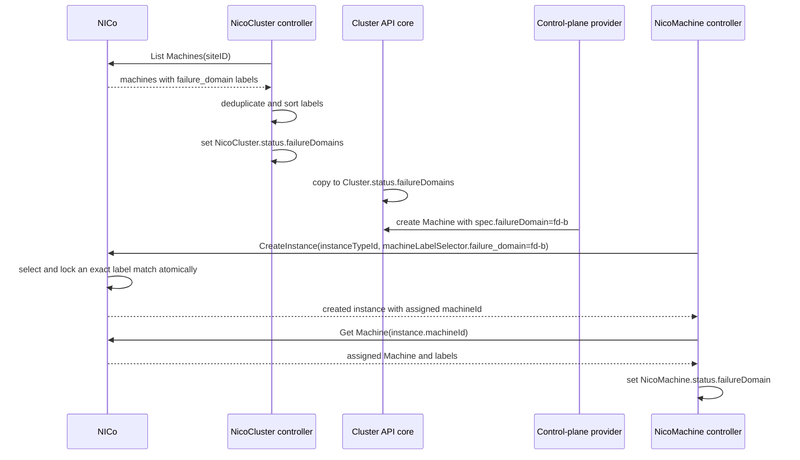

# Architecture

This page explains how `cluster-api-provider-nico` (CAPNICo) turns Cluster API
objects into bare-metal machines running in NICo.

This page states its claims against the code, and it names the relevant package
wherever the behavior is subtle, so you can check it yourself.

## Where This Provider Sits

CAPNICo is a Cluster API infrastructure provider. It provisions machines and
carries bootstrap data to them. It does not install Kubernetes, and it does not
run the join itself. The kubeadm bootstrap and control-plane providers generate
the cloud-init, and CAPNICo hands it to NICo as instance user data. The
following diagram shows how a `Machine` becomes a booting instance.

```
  Cluster API core
        │
        │  Machine.spec.bootstrap.configRef ──► kubeadm bootstrap provider
        │                                              │
        │                                     writes a bootstrap data Secret
        │                                              │
        │  Machine.spec.infrastructureRef               │
        ▼                                              ▼
  NicoCluster / NicoMachine  ◄──── reads the Secret, extracts the cloud-config
        │
        │  NICo REST API: CreateInstance, user data attached
        ▼
  NVIDIA Infra Controller (NICo)  ──►  an instance boots from its iPXE script
```

The bootstrap payload travels through this provider. The controller reads the
bootstrap data Secret, extracts the cloud-config, and sets it as the instance's
user data on the create request.

The management cluster must be able to reach the NICo API, and the target VPC
and its subnet or VPC prefix must already exist.

## The Resources

The provider defines four kinds, and the following table shows what each one
holds.

| Kind | Holds |
|---|---|
| `NicoCluster` | `spec.siteID`, optional `spec.identityRef`, and optional `spec.failureDomainLabelKey`, which enables failure-domain discovery and instance placement. |
| `NicoMachine` | One NICo instance. `spec.vpcID` is required and lives here, not on `NicoCluster`. |
| `NicoMachineTemplate` | The template consumed by `KubeadmControlPlane` and `MachineDeployment`. |
| `NicoClusterTemplate` | A type that exists and generates a CRD. Nothing in this repository consumes it yet. There is no ClusterClass or topology handling, and no example uses it. |

`NicoMachine.spec` remains editable until the controller assigns
`spec.providerID`. After that assignment, the entire spec is immutable because
CAPNICo currently uses these fields to build the NICo instance create request
but does not apply later changes to the existing instance. Metadata and status
updates remain allowed. The controller's initial provider ID assignment is the
transition that freezes the spec.

`NicoMachineTemplate.spec.template.spec` is immutable. To change machine
infrastructure, create a new `NicoMachineTemplate` and update the
`KubeadmControlPlane` or `MachineDeployment` reference so Cluster API performs a
replacement rollout. Template metadata remains mutable.

The API group is `infrastructure.cluster.x-k8s.io/v1alpha1`. `metadata.yaml`
records the Cluster API contract each release series implements. That contract
is currently `v1beta2`.

The site and the VPC come from different objects. The site applies to the whole
cluster, and the VPC applies to one machine. A reconcile reads
`nicoCluster.Spec.SiteID` and `nicoMachine.Spec.VPCID` separately, and the
create request carries the machine's VPC.

## Credential Resolution

Every reconcile resolves credentials in a fixed order.

1. The Secret named by `NicoCluster.spec.identityRef.name`, in the
   `NicoCluster`'s own namespace, when that field is set.
2. Otherwise the provider-level Secret in the manager's namespace, named by
   `--provider-credentials-namespace` (default `$POD_NAMESPACE`, falling back to
   `capnico-system`) and `--provider-credentials-secret-name` (default
   `nico-credentials`).
3. Otherwise the reconcile fails with a not-found error.

**Clients are cached per Secret revision.** The cache key is
`namespace/name@resourceVersion`, and inserting a new revision evicts earlier
entries sharing the `namespace/name@` prefix. That is what makes external
credential rotation work. When something like External Secrets Operator
rewrites the Secret, the `resourceVersion` changes, the old client is evicted,
and the next reconcile builds a new one. No manager restart is needed, and no
auth state lives in CR status.

The provider performs the OAuth2 client-credentials exchange itself, wrapping it
in a reusing token source and injecting the token into the SDK per request. The
published NICo SDK accepts a bearer token in the request context but has no
helper for acquiring one.

Refer to the
[README](https://github.com/dsx-ai-factory/cluster-api-provider-nico/blob/main/README.md#nico-credentials-secret)
for the Secret's key layout and both authentication modes.

## Machine Reconciliation

A create-path reconcile is not a single API call. One pass can resolve the
tenant, read the instance type, create the instance, read it back, look up the
site through a paginated lookup and the VPC, apply labels, and trigger a
reboot. What it
does not do is block waiting for the instance to become ready. It evaluates
readiness in the same pass and requeues if the instance is not there yet.

Create is idempotent only for the already-exists case. If `CreateInstance`
fails with an already-exists error, the controller looks the instance up by name
and adopts it. That error is produced from an HTTP 409 whose body says the
instance already exists. Any other 409 becomes a plain conflict and fails the
reconcile without adoption.

`status.instanceID` is the link back to the real instance. On delete, the
controller reads the instance before deleting it, so an instance that is
already released or mid-teardown is not deleted twice. It then holds the
finalizer and requeues until the instance reaches a terminal state, so the
finalizer guards the completion, not just the request. NICo retains terminated
instance records, so both `Terminated` and not-found count as released. Do not
remove the finalizer while `status.instanceID` can still refer to a live
instance.

`NicoCluster` holds its own finalizer and refuses to release it while any
`NicoMachine` remains in the same namespace carrying a matching
`cluster.x-k8s.io/cluster-name` label.

## Failure Domains

Topology comes from NICo Machine labels. Discovery, placement, and verification
all read the labels on the same Machine records. The label key is
`NicoCluster.spec.failureDomainLabelKey`. It has no default, so leaving it unset
disables failure domains for the cluster. An existing cluster therefore does not
start constraining placement the moment its site's Machines happen to carry a
`failure_domain` label. Sites following the NICo convention set it to
`failure_domain`. The following sequence diagram shows how a domain travels
from NICo labels to a placed instance.



CAPNICo never chooses the domain itself. It publishes the label-derived choices
and honors the domain selected by Cluster API. It expresses that choice on the
create request as JSON
`machineLabelSelector: {"failure_domain":"fd-b"}`. The generated Go SDK names
the `map[string]string` field `MachineLabelSelector` and provides
`SetMachineLabelSelector`.

With `instanceTypeId`, NICo chooses a matching free Machine and locks it as part
of the create operation. CAPNICo does not list or choose a concrete Machine, so
there is no client-side race between listing and creating. A non-empty selector
requires NICo's effective `targetedInstanceCreation` capability for the selected
site, including automatic `instanceTypeId` placement. An explicitly configured
`NicoMachine.spec.machineID` is retained as `machineId` and validated atomically
against the same selector. Explicit placement requires that same capability.
CAPNICo never falls back to an unconstrained create.

This behavior requires a NICo server containing
[NVIDIA/infra-controller#5484](https://github.com/NVIDIA/infra-controller/pull/5484),
merged to `main` on August 28, 2026. The SDK module `rest-api/sdk/standard`
carries no semver tags, so CAPNICo pins the pseudo-version
`v0.0.0-20260901235154-eafb6b962baf`. Older servers silently ignore unknown JSON
fields and are not compatible.

NICo also supports `machineLabelSelector` on batch instance allocation. CAPNICo
does not use that API. It reconciles one deterministically named `NicoMachine`
at a time and does not yet provide grouped NVLink co-placement. Guaranteeing
co-placement would require a separate group-reconciliation design.

Listing Machines is gated by the same `targetedInstanceCreation` capability as
the selector, so an identity that cannot list them cannot request a domain
either. NICo reports that as 403, and the cluster then publishes no domains and
provisions normally. A 401 is a credential problem rather than a missing
capability, and is handled as a discovery error instead.

Any discovery error before the first successful publication keeps the
`NicoCluster` unprovisioned, so control-plane machines are not created against
an unknown domain list. After publication, a later refresh error preserves the
previous list, because an empty list would tell Cluster API that no spread is
required.

Discovery considers only Machines that have an Instance Type, since placement
selects within one. It deliberately does not filter on Machine status or
assignment. The published list feeds `Cluster.status.failureDomains`, and a
domain that vanished while its Machines were busy would make Cluster API treat
the control-plane machines already placed there as out of their failure domain.
The consequence is an operational requirement. Every published domain needs
Machines of every Instance Type the cluster provisions. Otherwise, a
control-plane machine assigned to a domain that has none retries placement
indefinitely under `FailureDomainUnavailable`.

The published list is capped at the 100 domains the CRD allows, and anything
beyond that is dropped in sort order and logged.

### Placement Failures

`FailureDomainUnavailable` means the domain has no free Machine of the Instance
Type. It requeues, and it counts as an instance-type capacity wait, so a
control-plane machine blocked on it still defers workers of that type.

`FailureDomainPlacementFailed` covers the failures free capacity would not fix:
a Machine label selector the tenant lacks the capability to send, an explicit
`spec.machineID` that does not match the domain, or a requested domain on a
cluster with no `failureDomainLabelKey`. The capability case retries on a long
interval rather than terminally, because NICo grants that capability out of band
and no object this controller watches changes at that moment.

NICo enforces the selector inside the create transaction, so drift found after a
correct placement means a label changed afterward. That drift is reported on
the `FailureDomainDrifted` condition and in `status.failureDomain`. It does not
fail provisioning, because the instance is running, and marking it unavailable
would invite a `MachineHealthCheck` to delete a healthy node over a label edit.

## Provider ID and Node Matching

The kubeadm templates read the instance ID from the NICo metadata service at
`169.254.169.254:7777/latest/meta-data/instance-id` and patch kubelet with
`providerID: nico://<instance-id>`. That is how Cluster API matches a
workload-cluster `Node` back to its `Machine`. NICo's documentation describes
this as the Metadata Service (FMDS), a local HTTP metadata API served by the DPU
agent. Refer to
[Overview and Components](https://docs.nvidia.com/infra-controller/documentation/architecture/overview-and-components)
for details.

Once the backing instance identity is confirmed, the `NicoMachine` reconciler
also connects through the standard Cluster API kubeconfig Secret and fills an
empty `Node.spec.providerID`. Before Cluster API has a `status.nodeRef`, the
workload Node name must match the owning `Machine` name, as it does in the NKE
bootstrap flow. The reconciler treats an already matching value as complete and
never overwrites a different value. Annotate the Cluster API `Cluster` with
`nico.nvidia.com/skip-node-provider-id-reconciliation: "true"` when an external
cloud provider owns the Node provider ID.

## Teardown

Delete the Cluster API `Cluster` and let that deletion finish before you remove
the namespace. That order lets Cluster API delete machines before the shared
infrastructure object, and gives each `NicoMachine` a chance to issue its delete
while credentials still exist.

Deleting the namespace first can remove the per-cluster credentials Secret before
the finalizers run, which strands machines in deletion and leaves NICo instances
to clean up by hand.

## Annotation-Driven Operations

Two operations are contracts on the owning Cluster API `Machine` rather than
fields on either CRD, so a consumer can drive them without depending on this
API.
Both ignore an annotation whose value is empty, because the value carries
meaning in each case.

### The Repair Annotation

CAPNICo first tries to parse the value of
`nico.nvidia.com/machine-health-issue` as JSON, in the following shape:

```json
{"category": "Thermal", "summary": "over temperature", "details": "optional"}
```

A value that does not parse as JSON is treated as a legacy plain-string summary
and assigned the category `Other`. Either way, the health issue is forwarded to
NICo as context on the delete request. Configure the key with
`--repair-annotation`, and set it empty to disable the feature.

### The Reboot Annotation

Setting `nico.nvidia.com/reboot` to a non-empty value requests one reboot. The
value itself is consumer-owned and is not otherwise interpreted. After NICo
accepts the trigger, the provider removes the annotation, so one reboot happens
per application. Configure the key with `--reboot-annotation`.

## Related Information

- The [README](https://github.com/dsx-ai-factory/cluster-api-provider-nico/blob/main/README.md)
  has the installation steps, the credentials Secret, and the worked
  `clusterctl` examples.
- The [API Reference](api-reference.md) documents all four CRDs, field by field.
- [Troubleshooting](troubleshooting.md) gives the symptom, cause, and fix for
  problems beyond the stall-reason table in Getting Started.
- The [contributing guide](https://github.com/dsx-ai-factory/cluster-api-provider-nico/blob/main/CONTRIBUTING.md)
  describes the development setup and the pull request flow.
- The [agent conventions](https://github.com/dsx-ai-factory/cluster-api-provider-nico/blob/main/AGENTS.md)
  set out what this codebase holds to.
- The [release process](https://github.com/dsx-ai-factory/cluster-api-provider-nico/blob/main/RELEASE.md)
  explains versioning and the Cluster API contract.
